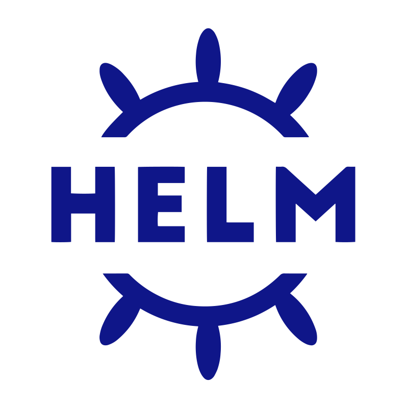

---

# 😏 &nbsp; Objective

&nbsp; My goal is to add as much value to a company while simultaneously learning new professional techniques and skills to further develop my career.

--- 

# 😊 &nbsp; Interpersonal skills:

- Teamplayer
- Enthusiastic and self-directed
- Adaptability
- Excellent communication skills
- Intercultural communication
- Competent
- Diligent

---

# 🤓 &nbsp; Technical stack

## What I know
<div>
    
    
    
    
    
    

    
    
</div>


## Version Control Tools
<div>
    
    
</div>

## Databases
<div>
    
    
    
</div>

##  What I had experience with
<div>
    
    
    
    
    
    
</div>

---

# 🫡 &nbsp; Contact me

```angular2html
ligay.aleksandra1996@gmail.com
```

<a href="www.linkedin.com/in/aleksandra-ligay-349775292">
    
</a>

